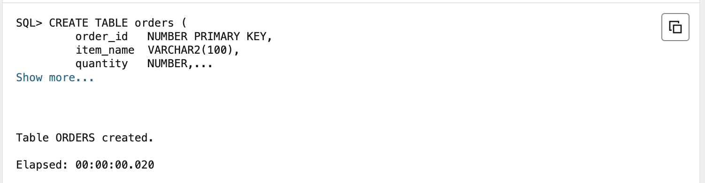
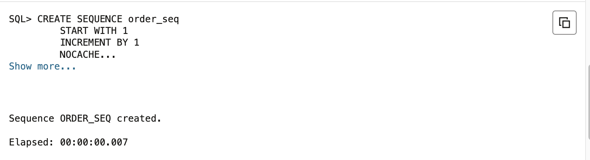
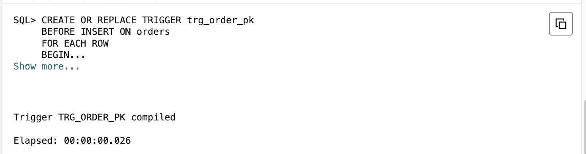
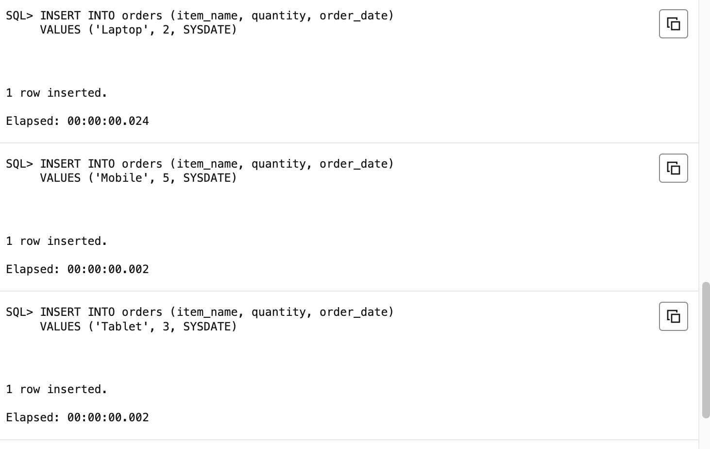
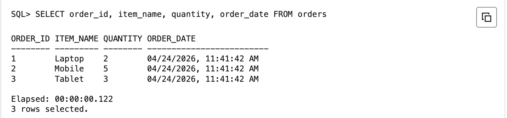

# **Experiment 10**

| Student Name: Harshit Kumawat UID: 24BAI70025 Branch: CSE AIML Section/Group: 24AIT_KRG G1 | Semester: 4 Date of Performance: 24/4/26 Subject Name: DBMS Subject Code: 24CSH-298 |
| :------------------------------------------------------------------------------------------- | :---------------------------------------------------------------------------------- |

---

## **Aim**

To design a trigger that automatically implements the functionality of a primary key, ensuring unique identification of records without manual intervention.

---

## **Software Requirements**

**Database Management System:**

- Oracle Database Express Edition Oracle XE  
- PostgreSQL Database  

**Database Administration Tool Client Tool:**

- Oracle SQL Developer for Oracle XE  
- pgAdmin for PostgreSQL  

---

## **Objectives**

- To create a database trigger that automatically enforces primary key constraints or generates unique key values, replicating the functionality of a stored procedure.

---

## **Problem Statement**

In enterprise databases, primary keys must be unique for every record. Manual assignment of keys can lead to errors.

Design a trigger that:

- Automatically generates or enforces a primary key value during record insertion  
- Implements logic similar to a stored procedure  
- Demonstrates automated primary key functionality for a table  

Industry relevance includes systems like Amazon, Flipkart, and Oracle.

---

## **Practical Experiment Steps**

- Table Setup Created the target table orders without a default primary key generator to simulate the manual key assignment problem  
- Sequence Creation Defined an Oracle sequence order_seq to serve as the reliable counter for unique numeric IDs  
- Trigger Design Designed a BEFORE INSERT trigger trg_order_pk on the orders table to intercept each insertion event  
- Auto Key Assignment Implemented logic inside the trigger to fetch the next value from the sequence and assign it to NEW.order_id  
- Insertion Testing Executed multiple INSERT statements without specifying an order_id  
- Output Verification Queried the orders table after all insertions to confirm unique sequential primary key values  

---

## **Procedure**

- Connected to Oracle or PostgreSQL environment and enabled DBMS output console  
- Created the orders table with order_id as the primary key column  
- Created a sequence order_seq starting from 1 with increment of 1  
- Wrote and compiled the BEFORE INSERT trigger trg_order_pk  
- Inserted multiple rows without specifying order_id  
- Verified output using SELECT query  

---

## **Input Output Analysis**

### **SQL Query**

```sql
CREATE TABLE orders (
    order_id   NUMBER PRIMARY KEY,
    item_name  VARCHAR2(100),
    quantity   NUMBER,
    order_date DATE
);
```

### **Output**



---

### **SQL Query**

```sql
CREATE SEQUENCE order_seq
START WITH 1
INCREMENT BY 1
NOCACHE
NOCYCLE;
```

### **Output**



---

### **SQL Query**

```sql
CREATE OR REPLACE TRIGGER trg_order_pk
BEFORE INSERT ON orders
FOR EACH ROW
BEGIN
    IF :NEW.order_id IS NULL THEN
        :NEW.order_id := order_seq.NEXTVAL;
    END IF;
END;
/
```

### **Output**



---

### **SQL Query**

```sql
INSERT INTO orders (item_name, quantity, order_date)
VALUES ('Laptop', 2, SYSDATE);

INSERT INTO orders (item_name, quantity, order_date)
VALUES ('Mobile', 5, SYSDATE);

INSERT INTO orders (item_name, quantity, order_date)
VALUES ('Tablet', 3, SYSDATE);

COMMIT;
```

### **Output**



---

### **SQL Query**

```sql
SELECT order_id, item_name, quantity, order_date FROM orders;
```

### **Output**



---

## **Learning Outcomes**

- Understood the working of database triggers and event driven execution  
- Learned automated primary key generation using triggers and sequences  
- Ensured data integrity without manual intervention  
- Applied real world concepts used in enterprise systems like Amazon Flipkart and Oracle 
