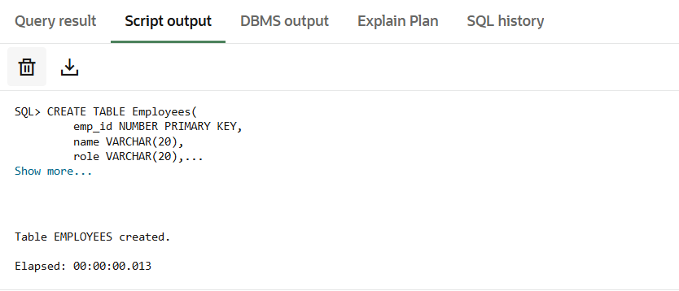
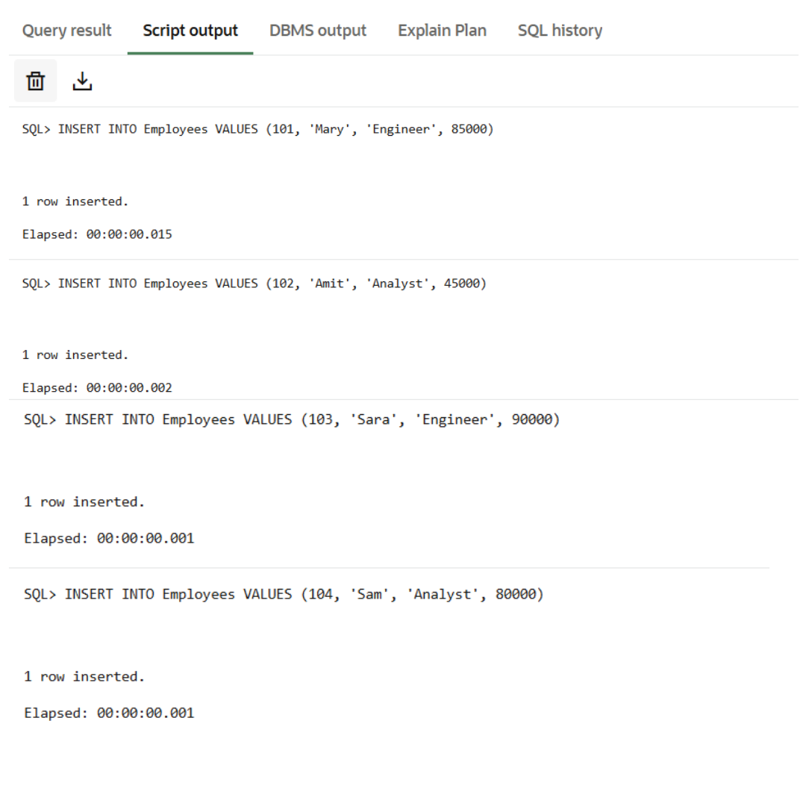
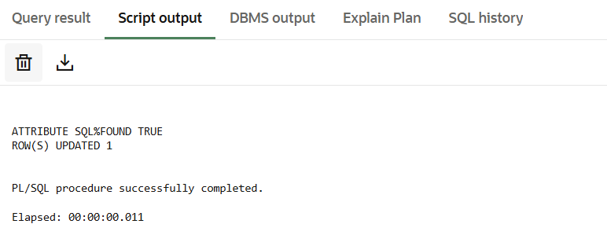
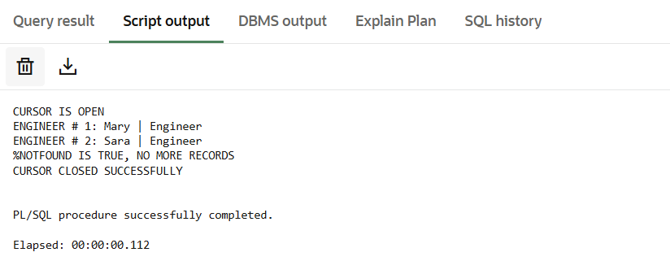

# Experiment 6: Cursors in PL/SQL

## 📌 Student Information

* **Name:** Harshit Kumawat
* **UID:** 24BAI70025
* **Branch:** CSE (AIML)
* **Section/Group:** 24AIT_KRG G1
* **Semester:** 4
* **Date of Performance:** 13 March 2026
* **Subject:** DBMS
* **Subject Code:** 24CSH-298

---

## 🎯 Aim

To understand the concept and working of cursors in PL/SQL for row-by-row data processing, and to analyze how implicit cursors, explicit cursors, and cursor attributes are used to implement business logic on multiple rows in a database table.

---

## 💻 Software Requirements

* **Database Management Systems:**

  * Oracle Database Express Edition (Oracle XE)
  * PostgreSQL

* **Client Tools:**

  * Oracle SQL Developer
  * pgAdmin

---

## 🎯 Objectives

* To implement and analyze implicit and explicit cursors.
* To understand cursor attributes such as `%FOUND`, `%NOTFOUND`, `%ROWCOUNT`, and `%ISOPEN`.
* To process multiple rows and apply business logic effectively.

---

## 📖 Problem Statement

In real-world applications, database queries often return multiple rows that must be processed individually to apply specific business rules.

---

## 🧪 Experiment Steps

1. Created an `Employees` table to simulate a real-world database.
2. Used an implicit cursor to perform an `UPDATE` operation.
3. Implemented an explicit cursor to fetch employees with the role "Engineer".
4. Used cursor attributes to control program flow.
5. Applied business logic such as salary updates and formatted outputs.

---

## ⚙️ Procedure

1. Enabled `SERVEROUTPUT` to display results.
2. Created the table and inserted sample data.
3. Used an implicit cursor to update salary and verified using `SQL%ROWCOUNT`.
4. Declared and opened an explicit cursor.
5. Fetched records using a loop.
6. Used `%NOTFOUND` to exit the loop.
7. Displayed row count using `%ROWCOUNT`.
8. Closed the cursor and verified using `%ISOPEN`.

---

## 🧾 SQL Queries

### 🔹 Create Table

```sql
CREATE TABLE Employees(
    emp_id NUMBER PRIMARY KEY,
    name VARCHAR(20),
    role VARCHAR(20),
    salary NUMBER
);
```
📷 Output:


### 🔹 Insert Data

```sql
INSERT INTO Employees VALUES (101, 'Mary', 'Engineer', 85000);
INSERT INTO Employees VALUES (102, 'Amit', 'Analyst', 45000);
INSERT INTO Employees VALUES (103, 'Sara', 'Engineer', 90000);
INSERT INTO Employees VALUES (104, 'Sam', 'Analyst', 80000);
COMMIT;
```
📷 Output:


### 🔹 Implicit Cursor Example

```sql
SET SERVEROUTPUT ON;

DECLARE
    v_target_id NUMBER := 101;

BEGIN
    UPDATE Employees
    SET salary = salary * 1.10
    WHERE emp_id = v_target_id;

    IF SQL%FOUND THEN
        DBMS_OUTPUT.PUT_LINE('ATTRIBUTE SQL%FOUND TRUE');
        DBMS_OUTPUT.PUT_LINE('ROW(S) UPDATED ' || SQL%ROWCOUNT);
    ELSE
        DBMS_OUTPUT.PUT_LINE('NO ROW UPDATED');
    END IF;
END;
```
📷 Output:


### 🔹 Explicit Cursor Example

```sql
DECLARE
    CURSOR c_engg IS 
        SELECT name, role FROM Employees WHERE role = 'Engineer';

    v_name Employees.name%TYPE;
    v_role Employees.role%TYPE;

BEGIN
    OPEN c_engg;

    IF c_engg%ISOPEN THEN
        DBMS_OUTPUT.PUT_LINE('CURSOR IS OPEN');
    END IF;

    LOOP
        FETCH c_engg INTO v_name, v_role;

        IF c_engg%NOTFOUND THEN
            DBMS_OUTPUT.PUT_LINE('%NOTFOUND IS TRUE, NO MORE RECORDS');
            EXIT;
        END IF;

        DBMS_OUTPUT.PUT_LINE(
            'ENGINEER #' || c_engg%ROWCOUNT || ': ' 
            || v_name || ' | ' || v_role
        );
    END LOOP;

    CLOSE c_engg;

    IF NOT c_engg%ISOPEN THEN
        DBMS_OUTPUT.PUT_LINE('CURSOR CLOSED SUCCESSFULLY');
    END IF;
END;
```
📷 Output:



---

## 📊 Output

* Successful table creation and data insertion
* Salary updated using implicit cursor
* Engineers fetched using explicit cursor
* Cursor attributes displayed correct execution flow

---

## 📚 Learning Outcomes

* Understood implicit vs explicit cursors
* Learned use of cursor attributes for control flow
* Gained knowledge of cursor lifecycle (OPEN, FETCH, CLOSE)
* Applied business logic on row-level data processing

---

## ✅ Conclusion

This experiment demonstrated how cursors in PL/SQL help process multiple rows efficiently and apply business logic at a granular level, which is essential for enterprise database applications.

---
