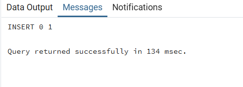
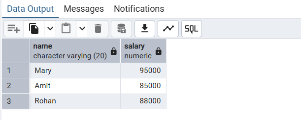
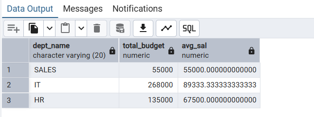
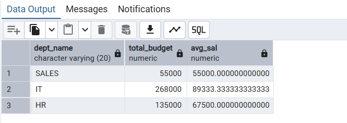
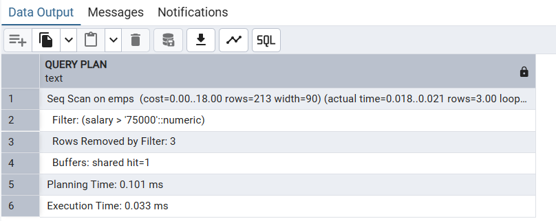
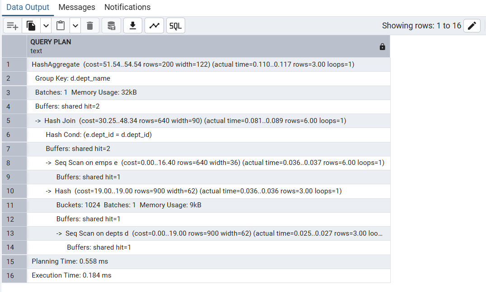
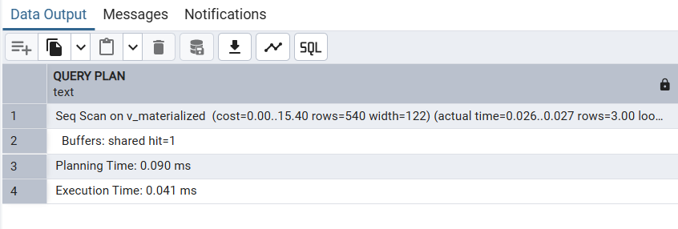

# 📊 DBMS Experiment 7 – Views vs Materialized Views Performance Analysis

## 👨‍🎓 Student Details

* **Name:** Harshit Kumawat  
* **UID:** 24BAI70025  
* **Branch:** CSE (AIML)  
* **Section/Group:** 24AIT_KRG G1  
* **Semester:** 4  
* **Subject:** DBMS (24CSH-298)  
* **Date:** 13/03/2026  

---

## 🎯 Aim

To design and implement **simple views, complex views, and materialized views**, and analyze their performance using execution time comparison.

---

## 🛠️ Software Requirements

* **Database:** PostgreSQL / Oracle XE  
* **Tools:** pgAdmin / Oracle SQL Developer  

---

## 🎯 Objectives

* Create simple, complex, and materialized views  
* Compare execution time using `EXPLAIN ANALYZE`  
* Understand performance benefits of materialized views  

---

## ⚙️ Experiment Steps

1. Create tables (`depts`, `emps`)  
2. Insert sample data  
3. Create:
   * Simple View  
   * Complex View  
   * Materialized View  
4. Run queries on each  
5. Analyze performance using `EXPLAIN ANALYZE`  
6. Refresh materialized view  

---

## 🧪 Input / Output Analysis

### 1️⃣ Table Creation

```sql
CREATE TABLE depts(
dept_id INT PRIMARY KEY,
dept_name VARCHAR(20)
);

CREATE TABLE emps(
emp_id INT PRIMARY KEY,
name VARCHAR(20),
dept_id INT REFERENCES depts(dept_id),
salary NUMERIC
);
```

**Output:**  


---

### 2️⃣ Insert Data

```sql
INSERT INTO depts VALUES(1, 'IT'), (2, 'HR'), (3, 'SALES');

INSERT INTO emps VALUES(101, 'Mary', 1, 95000);
INSERT INTO emps VALUES(102, 'Amit', 1, 85000);
INSERT INTO emps VALUES(103, 'Sarah', 2, 70000);
INSERT INTO emps VALUES(104, 'John', 2, 65000);
INSERT INTO emps VALUES(105, 'Jack', 3, 55000);
INSERT INTO emps VALUES(106, 'Rohan', 1, 88000);
```

**Output:**  


---

### 3️⃣ Simple View

```sql
CREATE VIEW V_SIMPLE AS
SELECT name, salary FROM emps WHERE salary > 75000;

SELECT * FROM V_SIMPLE;
```

**Output:**  


---

### 4️⃣ Complex View

```sql
CREATE VIEW V_COMPLEX AS
SELECT d.dept_name,
       SUM(e.salary) AS total_budget,
       AVG(e.salary) AS avg_sal
FROM emps e
JOIN depts d ON e.dept_id = d.dept_id
GROUP BY d.dept_name;

SELECT * FROM V_COMPLEX;
```

**Output:**  


---

### 5️⃣ Materialized View

```sql
CREATE MATERIALIZED VIEW V_MATERIALIZED AS
SELECT d.dept_name,
       SUM(e.salary) AS total_budget,
       AVG(e.salary) AS avg_sal
FROM emps e
JOIN depts d ON e.dept_id = d.dept_id
GROUP BY d.dept_name;

SELECT * FROM V_MATERIALIZED;
```

**Output:**  


---

### 6️⃣ Refresh Materialized View

```sql
REFRESH MATERIALIZED VIEW V_MATERIALIZED;
```

**Output:**  


---

### 7️⃣ Performance Analysis

#### Simple View

```sql
EXPLAIN ANALYZE SELECT * FROM V_SIMPLE;
```



---

#### Complex View

```sql
EXPLAIN ANALYZE SELECT * FROM V_COMPLEX;
```



---

#### Materialized View

```sql
EXPLAIN ANALYZE SELECT * FROM V_MATERIALIZED;
```



---

## 📈 Learning Outcomes

* Understood difference between **simple, complex, and materialized views**  
* Learned how materialized views improve performance  
* Used `EXPLAIN ANALYZE` for query optimization  
* Observed real-world use of precomputed data in systems  

---

## 🚀 Conclusion

Materialized views significantly reduce query execution time by storing precomputed results, making them highly efficient for large-scale and frequently accessed data systems.
