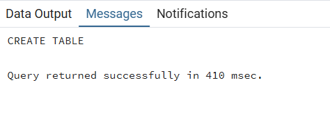
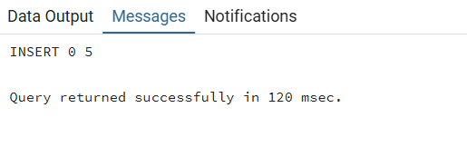
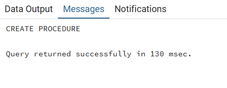
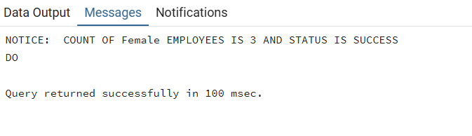

# 📊 DBMS Experiment 8 – Stored Procedures in PL/SQL

## 👨‍🎓 Student Details

* **Name:** Harshit Kumawat
* **UID:** 24BAI70025
* **Branch:** CSE (AIML)
* **Section/Group:** 24AIT_KRG G1
* **Semester:** 4
* **Date of Performance:** 27/03/2026
* **Subject Name:** DBMS
* **Subject Code:** 24CSH-298

---

## 🎯 Aim

To understand the design and implementation of stored procedures in PL/SQL, focusing on the use of different parameter modes (IN, OUT, and INOUT) to encapsulate business logic and facilitate modular programming within a database.

---

## 💻 Software Requirements

### Database Management System

* Oracle Database Express Edition (Oracle XE)
* PostgreSQL Database

### Database Administration Tool / Client Tool

* Oracle SQL Developer (for Oracle XE)
* pgAdmin (for PostgreSQL)

---

## 📌 Objectives

* To create and execute a parameterized stored procedure that processes data from an employee table, utilizes multiple parameter types to return calculated results and execution status, and demonstrates the invocation of procedures using anonymous blocks.

---

## 🧪 Practical / Experiment Steps

* Database Schema Provisioning: Created the employees table with a primary key and defined specific data types for personal and financial attributes.
* Procedure Encapsulation: Developed a stored procedure `get_employee_count_by_gender` to encapsulate the logic for counting records based on specific criteria.
* Parameter Mode Configuration: Implemented a diverse set of parameters including IN for input, OUT for returning the count, and INOUT for tracking and updating the execution status.
* Procedural Logic Integration: Used the SELECT INTO clause within the procedure body to map aggregate query results directly to output variables.
* Anonymous Block Execution: Constructed a DO block to declare local variables, handle the procedure call, and manage the final communication of results to the user.

---

## ⚙️ Procedure

* Established a connection to the PostgreSQL server and initialized the workspace.
* Executed the CREATE TABLE command to define the employee structure and populated it with a balanced dataset of male and female records.
* Defined the procedure signature, carefully assigning the IN, OUT, and INOUT modes to their respective variables.
* Wrote the PL/pgSQL body to perform a COUNT(*) operation filtered by the gender attribute.
* Assigned a 'SUCCESS' string to the STATUS variable within the procedure to indicate a completed execution path.
* Drafted a DECLARE section in an anonymous block to initialize the 'Male' gender filter and a 'Pending' status.
* Utilized the CALL statement to execute the procedure, passing the required arguments and capturing the returned values.
* Implemented the RAISE NOTICE command to print the final employee count and updated status to the console.
* Verified the output against the physical table records to ensure the aggregate logic and parameter passing were accurate.

---

## 📥 Input / Output Analysis

### SQL Input Queries

```sql
CREATE TABLE EMPLOYEES(
    emp_id INT PRIMARY KEY,
    emp_name VARCHAR(20),
    gender VARCHAR(20),
    salary NUMERIC(10, 2)
);
```

### Output





---

### SQL Input Queries

```sql
INSERT INTO employees (emp_id, emp_name, gender, salary) VALUES
(101, 'Amit', 'Male', 30000),
(102, 'Sarah', 'Female', 55000),
(103, 'Riya', 'Female', 45000),
(104, 'Arjun', 'Male', 59000),
(105, 'Anjali', 'Female', 66000);
```

### Output





---

### SQL Input Queries

```sql
CREATE OR REPLACE PROCEDURE get_employee_count_by_gender (
    IN IN_GENDER VARCHAR(20),
    OUT OUT_COUNT INT,
    INOUT STATUS VARCHAR(20)
)
AS
$$
BEGIN
    SELECT COUNT(*) INTO OUT_COUNT FROM employees WHERE gender = IN_GENDER;
    STATUS := 'SUCCESS';
END;
$$ LANGUAGE PLPGSQL;
```

### Output




---

### SQL Input Queries

```sql
DO
$$
DECLARE
    GEN VARCHAR(20) := 'Female';
    COUNT_OF_EMPLOYEES INT;
    STATUS VARCHAR := 'PENDING';

BEGIN
    CALL get_employee_count_by_gender(GEN, COUNT_OF_EMPLOYEES, STATUS);
    RAISE NOTICE 'COUNT OF % EMPLOYEES IS % AND STATUS IS %',
        GEN, COUNT_OF_EMPLOYEES, STATUS;
END;
$$;
```

### Output





---

## 📚 Learning Outcomes

* Understood how to encapsulate SQL logic into reusable procedures to improve code maintainability.
* Gained expertise in using IN, OUT, and INOUT modes to pass data into and retrieve results from stored subprograms.
* Learned to bridge SQL aggregate functions with PL/SQL variables using the INTO keyword.
* Developed skills in using status flags and notice alerts to track the success and results of procedural calls.
