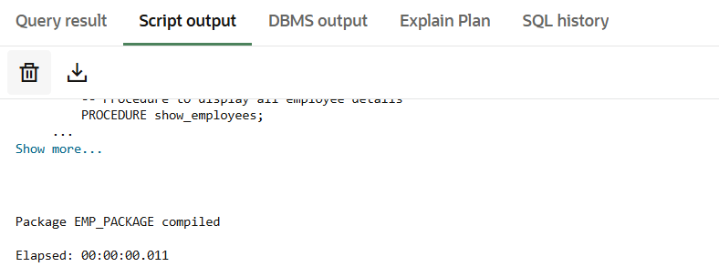
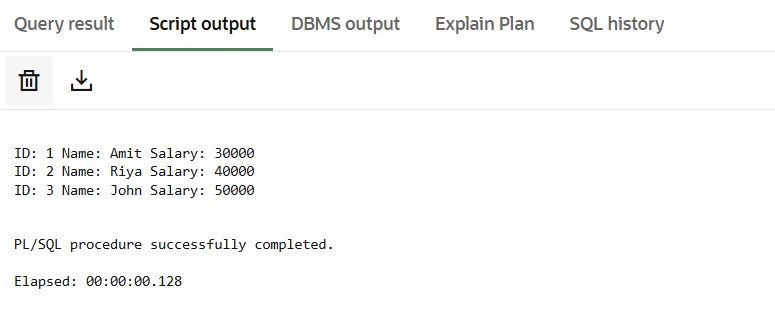
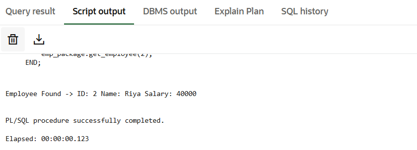

# Experiment 9

**Student Name:** Harshit Kumawat
**UID:** 24BAI70025
**Branch:** CSE (AIML)
**Section/Group:** 24AIT_KRG G1
**Semester:** 4
**Date of Performance:** 17/04/2026
**Subject Name:** DBMS
**Subject Code:** 24CSH-298

---

## 🎯 Aim

To create and implement PL/SQL packages by developing a package specification and package body containing procedures and shared cursors, in order to achieve modular, reusable, and efficient database programming.

---

## 💻 Software Requirements

### Database Management System

* Oracle Database Express Edition (Oracle XE)
* PostgreSQL Database

### Tools

* Oracle SQL Developer (for Oracle XE)
* pgAdmin (for PostgreSQL)

---

## 🎯 Objectives

* To design and implement a PL/SQL package that includes procedures and shared cursors for structured and modular program development.

---

## 📌 Problem Statement

* In enterprise applications, related database operations should be grouped together for better management and reuse.

---

## ⚙️ Practical / Experiment Steps

* Modular Architecture Design using PL/SQL package
* Created shared cursor for reusable data access
* Developed procedures for full and conditional data retrieval
* Implemented encapsulation and abstraction
* Performed integration testing

---

## 🧪 Procedure

1. Connected to database environment
2. Enabled output console
3. Created employees table
4. Inserted sample records
5. Created package specification
6. Created package body
7. Compiled package
8. Executed procedures

---

## 📊 Input / Output Analysis

### 🧾 Table Creation

```sql
CREATE TABLE employees (
    emp_id NUMBER PRIMARY KEY,
    emp_name VARCHAR2(50),
    salary NUMBER
);
```

### 📷 Output


---

### 🧾 Data Insertion

```sql
INSERT INTO employees VALUES (1, 'Amit', 30000);
INSERT INTO employees VALUES (2, 'Riya', 40000);
INSERT INTO employees VALUES (3, 'John', 50000);

COMMIT;
```

### 📷 Output


---

### 🧾 Package Specification

```sql
CREATE OR REPLACE PACKAGE emp_package AS
    PROCEDURE show_employees;
    PROCEDURE get_employee(p_id NUMBER);
END emp_package;
/
```

### 📷 Output



---

### 🧾 Package Body

```sql
CREATE OR REPLACE PACKAGE BODY emp_package AS

    CURSOR emp_cursor IS
        SELECT emp_id, emp_name, salary FROM employees;

    PROCEDURE show_employees IS
    BEGIN
        FOR rec IN emp_cursor LOOP
            DBMS_OUTPUT.PUT_LINE('ID: ' || rec.emp_id ||
                                 ' Name: ' || rec.emp_name ||
                                 ' Salary: ' || rec.salary);
        END LOOP;
    END;

    PROCEDURE get_employee(p_id NUMBER) IS
    BEGIN
        FOR rec IN emp_cursor LOOP
            IF rec.emp_id = p_id THEN
                DBMS_OUTPUT.PUT_LINE('Employee Found -> ID: ' || rec.emp_id ||
                                     ' Name: ' || rec.emp_name ||
                                     ' Salary: ' || rec.salary);
            END IF;
        END LOOP;
    END;

END emp_package;
/
```

### 📷 Output


---

### 🧾 Execution (Show Employees)

```sql
SET SERVEROUTPUT ON;

BEGIN
    emp_package.show_employees;
END;
/
```

### 📷 Output



---

### 🧾 Execution (Get Employee)

```sql
BEGIN
    emp_package.get_employee(2);
END;
/
```

### 📷 Output



---

## 📈 Learning Outcomes

* Understood package structure
* Learned modular programming in PL/SQL
* Used shared cursors effectively
* Implemented encapsulation and abstraction
* Improved code reusability and organization

---

## 📁 Image Folder Structure

Place all screenshots inside a folder named:

```
images/
```

And name them exactly:

```
image1.png
image2.png
image3.png
image4.png
image5.png
image6.png
image7.png
```

---
